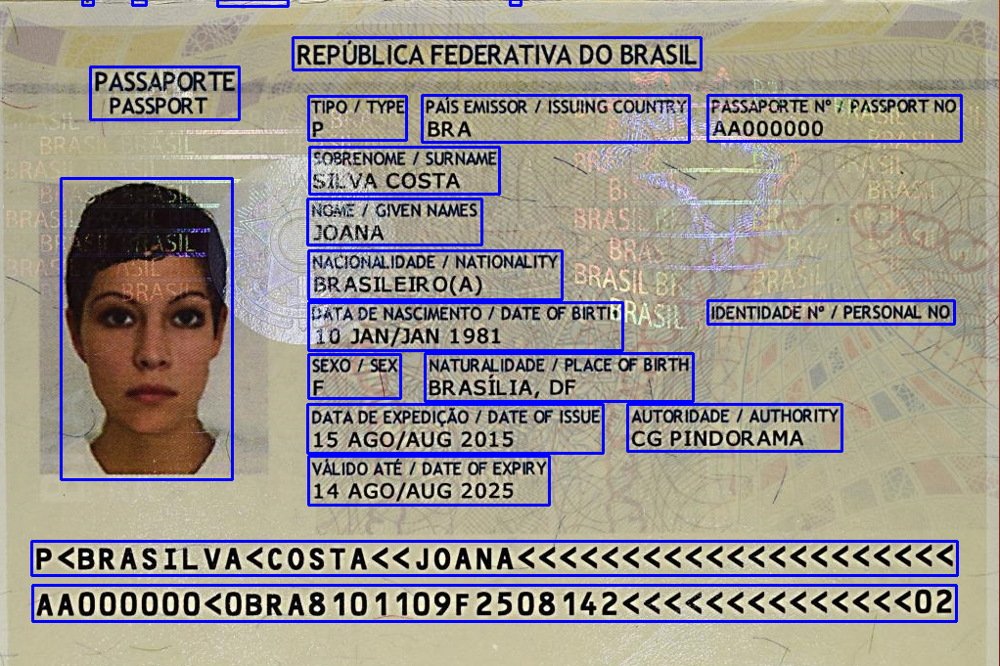

# Simple ID-Card Regconition with OCR Tesseract and evaluate score in MIDV-500 dataset

# Install requirements
```bash
pip3 install -r requirements.txt
```
# Running your example
```bash
python3 main.py -i [directory_to_your_image]
```


# Checkout score in MIDV-500

## Download MIDV-500 dataset and create pure dataset (because I only did my project on high quality images :( )
```bash
python3 exportdata.py
python3 createdata.py
```

## Measure in MIDV-500 dataset with Average IoU and Count the number of high matched bounding box to ground truth values
```bash
python3 measure.py
```
